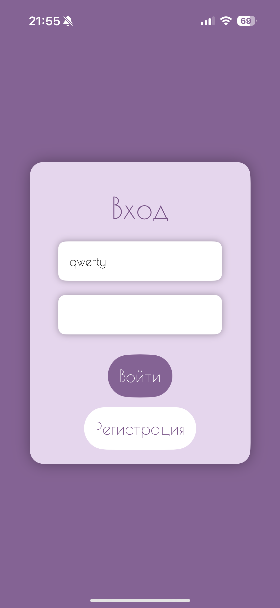
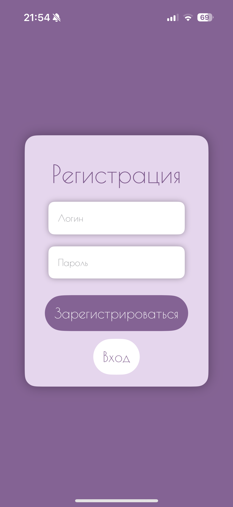
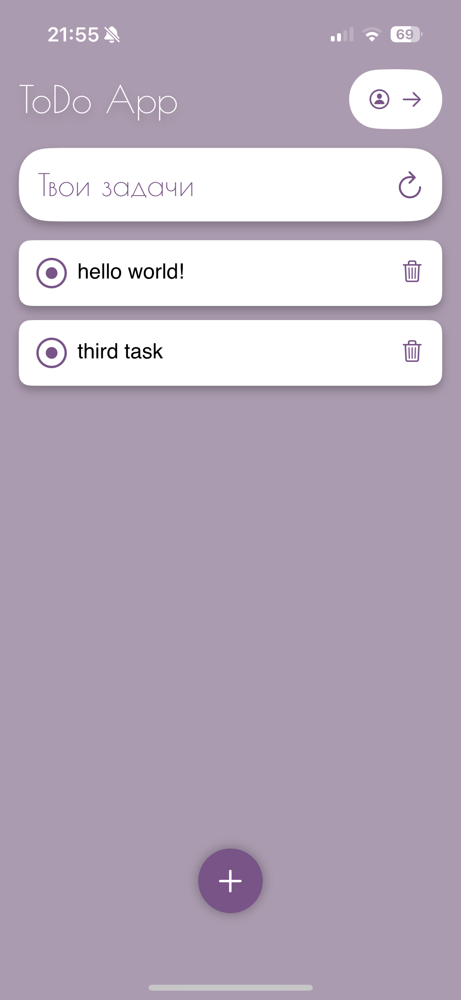
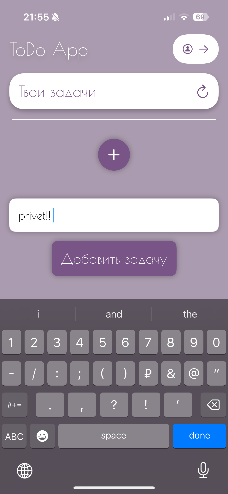

# **Todo App**

**Todo App** — это приложение для управления задачами с функциональностью для входа и регистрации. В приложении есть два экрана: экран авторизации и экран регистрации. Пользователи могут войти в систему или зарегистрироваться для начала работы с задачами. Это приложение будет полезно для пользователей, которые хотят организовать свои задачи и следить за их выполнением.

## **Основные возможности приложения:**

- **Авторизация**: Пользователи могут войти в систему с использованием логина и пароля.
- **Регистрация**: Возможность создать новый аккаунт.
- **Главный экран**: Доступ к задачам, с возможностью их добавления и выполнения.
  
---

## **Скриншоты приложения:**

### **Экран авторизации:**  


На этом экране пользователь может ввести свой логин и пароль для входа в систему. Также есть кнопка для перехода к экрану регистрации.

### **Экран регистрации:**  


Экран для регистрации нового пользователя, где можно ввести логин и пароль. После успешной регистрации пользователю будет предложено войти в систему.

### **Главный экран (после входа):**  
  
  

После успешного входа на главный экран пользователю предоставляется список задач с возможностью их добавления.

## **Как запустить iOS-приложение**  

### **1. Клонирование репозитория**  

Склонируйте репозиторий на свой компьютер:  

```bash
git clone https://github.com/sinooox/todo-app.git
```

### **2. Откройте проект в Xcode**  

1. Запустите **Xcode**.  
2. Перейдите в **File -> Open** и выберите папку с клонированным проектом.  
3. Убедитесь, что выбрана правильная **Scheme** (например, `TodoApp`).   

### **3. Настройте симулятор или подключите устройство**  

1. В Xcode выберите **Simulator** или подключите физическое устройство.  
2. Для запуска на реальном устройстве убедитесь, что у вас есть **учётная запись разработчика Apple** и выполнен **код-подписанный профиль** в **Signing & Capabilities**.  

### **4. Запустите приложение**  

Нажмите кнопку **Run** в Xcode или используйте сочетание клавиш `Cmd + R`, чтобы запустить приложение на симуляторе или устройстве.